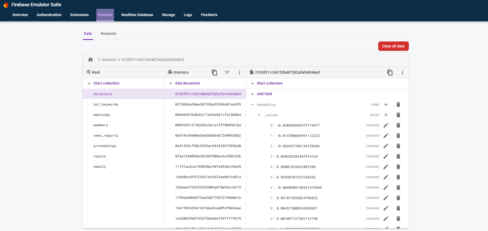

# 開發環境設定

立院知更主要由三個部份構成：

1. 前端 (Angular)
    另外搭配其它 UI 套件：
    - [PrimeNG](https://primeng.org/)
    - [PrimeFLEX](https://primeflex.org/)
2. 後端 API Server (Golang/Gin)
    提供前端所需要的 REST APIs，使用 Go 語言以減少 CPU 和記憶體的需求，進而減少冷啟動時間。
3. 後端資料處理 (Firebase)
    使用 Firestore 為主要資料庫。
    搭配 [Cloud Functions for Firebase](https://firebase.google.com/docs/functions)
    並使用 Python 最為主要的框架。
    多數的資料抓取、清理和 AI 相關的應用都是在這理實作。

本篇教學會著重在搭建最基本的本地開發環境，不包含 Cloud Functions 的部份。
使用 Cloud Functions 需要建置新的 Firebase Project，可能會需要支付雲端平台的使用費。
因此現階段暫時不詳細說明相關的設定。
有興趣的開發者，可以參考 Google 官方的說明文件來獲得更多訊息。

[Get started: write, test, and deploy your first functions](https://firebase.google.com/docs/functions/get-started?gen=2nd)

## 需求

立院知更可以在 Windows, Mac 和 Linux 環境開發。
主要的開發者使用的作業系統是 Windows (WSL) 和 Mac。

> [!NOTE]
> 使用 Windows 開發時，建議搭配 [WSL](https://learn.microsoft.com/zh-tw/windows/wsl/install) 使用。

在開始之前，請確認您的工作環境已經安裝了以下服務：

1. Docker
    - [Install Docker Desktop on Windows](https://docs.docker.com/desktop/setup/install/windows-install/)
    - [Install Docker Desktop on Mac](https://docs.docker.com/desktop/setup/install/mac-install/)
    - [Install Docker Desktop on Linux](https://docs.docker.com/desktop/setup/install/linux/)
2. Python (>= 3.12)
    - [下載](https://www.python.org/downloads/)
3. NPM
    - [Downloading and installing Node.js and npm](https://docs.npmjs.com/downloading-and-installing-node-js-and-npm)
4. Java
    - [JDK Development Kit downloads](https://www.oracle.com/java/technologies/downloads/)
5. Git
    - [Getting Started - Installing Git](https://git-scm.com/book/en/v2/Getting-Started-Installing-Git)

## 工作目錄設定

1. 下載專案原始碼

    請在您想要下載原始碼的工作目錄下，執行以下指令：
    
    ```bash
    git clone https://github.com/lyrobin/lyrobin.git
    cd lyrobin
    ```

    接下來的步驟，會預設在 `lyrobin` 資料夾下進行。當提到 `${WORKSPACE_ROOT}`時，就代表了 `lyrobin/` 目錄。

2. 下載資料快照
    
    立院知更會定期快照部份資料庫的檔案供開發者使用。
    檔案會上傳到 Google 雲端硬碟備份。
    請依序下載兩筆資料：
    - [firebase-data.zip](https://drive.google.com/file/d/1iq27POIvPFgU-9NF6HhzGc9sAUe1pHpE/view?usp=sharing)
    - [typesense-snapshot.zip](https://drive.google.com/file/d/1yZMQ99AhNxDVlcfcPPsgqKWRF_l-l1zZ/view?usp=sharing)

    > [!NOTE]
    > Typesense 是立院知更使用的全文搜尋引擎。詳細資料可至[官網](https://typesense.org/)查詢。

    下載後請執行以下指令解壓縮檔案：

    ```bash
    # cd ${WORKSPACE_ROOT}
    unzip firebase-data.zip -d .
    mkdir cloudrun/typesense-data
    unzip typesense-snapshot.zip -d cloudrun/typesense-data
    ```
## 開始運行本地端開發環境

1. 啟動 API Server

    後端服務主要是使用 Docker 容器佈署。執行以下指令：

    ```bash
    # cd ${WORKSPACE_ROOT}
    cd cloudrun
    docker-compose up -d
    ```

    第一次執行時會需要編譯映像檔，可以能需要 3 ~ 5 鐘的時間。
    服務會在背景執行，在看到以下訊息時即代表啟動成功。

    ```
    ✔ Network cloudrun_default                     Created    0.0s 
    ✔ Container cloudrun-typesense-1               Started    0.6s 
    ✔ Container cloudrun-api-server-1              Started    0.4s 
    ✔ Container cloudrun-my-libreoffice-service-1  Started    0.6s 
    ```

    若需停止服務，可執行以下指令：

    ```bash
    cd cloudrun
    docker-compose down
    ```

2. 啟動 Firestore 資料庫

    執行以下指令案裝 Firebase CLI:

    ```bash
    npm install -g firebase-tools
    ```

    第一次執行可能會需要執行以下指令來允許 Firebase 的實驗性功能：

    ```bash
    # cd ${WORKSPACE_ROOT}
    firebase experiments:enable webframeworks
    ```

    最後執行以下指令啟動 Firestore：

    ```bash
    firebase emulators:start --only=auth,firestore --import=firebase_data
    ```

    可以前往 [http://127.0.0.1:4000/firestore](http://127.0.0.1:4000/firestore) 確認是否有啟動成功。

    

    需要停止 Firestore 時，可以直接使用 `Ctrl + C`。

3. 啟動前端伺服器

    第一次執行時，請先執行以下指令安裝開發套件：

    ```bash
    # cd ${WORKSPACE_ROOT}
    npm install
    ```

    最後，執行以下指令：

    ```bash
    npm run start
    ```

    在看到以下訊息時，即代表啟動成功。
    可以前往 [http://localhost:4200/](http://localhost:4200/) 確認運行正確。

    ```bash
    Application bundle generation complete. [2.701 seconds]

    Watch mode enabled. Watching for file changes...
    NOTE: Raw file sizes do not reflect development server per-request transformations.
    ➜  Local:   http://localhost:4200/
    ➜  press h + enter to show help
    ```

    需要停止伺服器時，可以直接使用 `Ctrl + C`。
